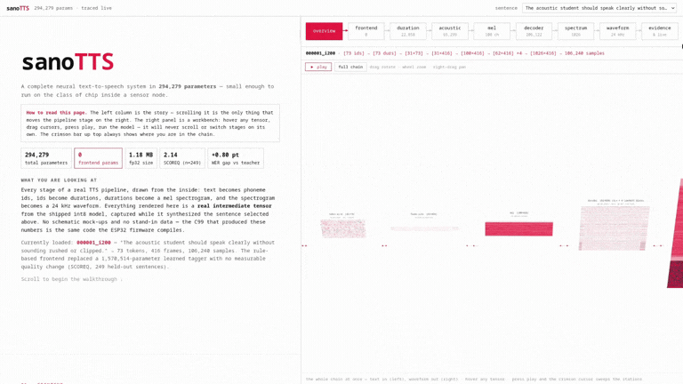

# sanoTTS — Inside a 294,279-Parameter TTS System

**Distill your own tiny voice.** An interactive, scroll-driven walkthrough of
**sanoTTS**, a complete neural text-to-speech system small enough to run on
microcontroller-class hardware (e.g. ESP32-S3). Every tensor shown on the page
is a real intermediate value captured from the shipped int8 model while it
synthesized an actual sentence — no mock-ups, no stand-in data.

- **Inside sanoTTS:** <https://ampixa.github.io/sanotts-anatomy/>
- **sanoTTS Playground (Distill your own tiny voice
):** <https://github.com/Ampixa/sanoTTS>
  [eSpeak NG](https://github.com/espeak-ng/espeak-ng))



## What the site shows

The page follows the full synthesis pipeline, stage by stage:

```text
Text
 ↓   rule-based frontend (Misaki G2P, zero learned parameters)
Phoneme IDs
 ↓   duration predictor (22,858 params)
Durations
 ↓   dual-rate acoustic model (65,299 params)
Mel spectrogram (100 channels)
 ↓   waveform decoder (206,122 params, ConvNeXt-style + iSTFT head)
PCM audio (24 kHz)
```

Along the way you can:

- Inspect the real phoneme→id chain, predicted durations, hidden states, mel
  spectrograms, decoder activations, spectra, and the final waveform.
- Play the traced audio and scrub a cursor across every visualization in sync.
- See the full parameter budget, the controlled quality lanes, the evaluation
  evidence (ASR word error rate, MOS pilot, objective metrics), and the
  microcontroller deployment numbers.
- **Run the actual engine in your browser** — the same int8 C99 inference code
  the ESP32 compiles, built to WebAssembly — and verify that it reproduces the
  shipped trace sample-for-sample.

## Run locally

Requires Node.js 18+.

```bash
npm install
npm run dev
```

Then open the printed local URL (default <http://localhost:5173>).

## Build

```bash
npm run build    # type-check + production bundle in dist/
npm run preview  # serve the production build locally
```

The build is fully static: no cookies, no tracking, no server-side component.

## How to read the page

- **Left column** — the story. Scrolling it is the only thing that moves the
  pipeline stage on the right.
- **Right panel** — an interactive workbench for the current stage: hover
  tensors for exact values, drag cursors, press play, run the model. It never
  scrolls or switches stages on its own.
- **Top bar** — the crimson schematic always shows where you are in the chain
  and provides explicit navigation, plus a sentence selector that swaps the
  loaded trace.

## Data provenance

- Walkthrough tensors are precomputed traces of the shipped int8 engine,
  loaded from `public/traces/`.
- Live inference runs `public/engine/snt_nano_heartnano.wasm`, compiled from
  the same portable C99 runtime that targets the microcontroller.
- All headline figures (parameter counts, SCOREQ lanes, WER, MOS, board RTF)
  come from the sanoTTS paper; `src/data/paperFacts.ts` maps each displayed
  number to the section or table where it is reported.


## License

This project is open source under the
[GNU General Public License v3.0](LICENSE) (GPL-3.0). sanoTTS builds on the
work of [Piper](https://github.com/rhasspy/piper) and
[eSpeak NG](https://github.com/espeak-ng/espeak-ng).

**Distill your own tiny voice:** <https://github.com/Ampixa/sanoTTS>
